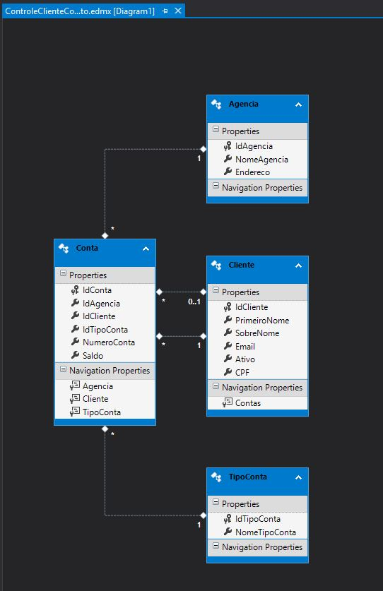

# controle clientes

Sistema de controle de clientes desenvolvido para um teste.

Observação, executar o comando 
```Update-Database –Verbose```
no Package Manager Console do Visual Studio para criar e restaurar a base de dados da aplicação. 

Também é possível restaurar a base de dados utilizando o arquivo .bak incluído na pasta /Docs.


