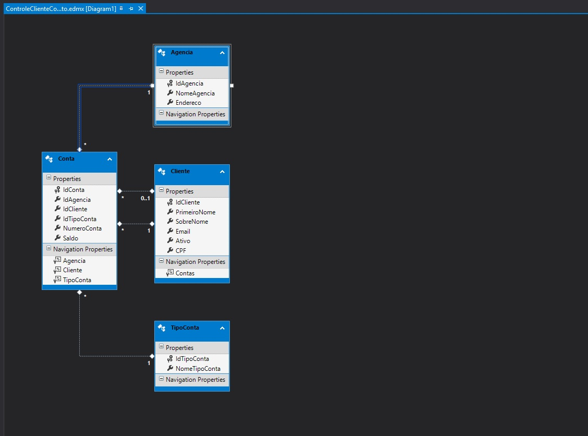

# controleclientecog

Sistema de controle de clientes desenvolvido para teste na Cognizant.

Observação, executar o comando 
```Update-Database –Verbose```
no Package Manager Console do Visual Studio para criar e restaurar a base de dados da aplicação.

